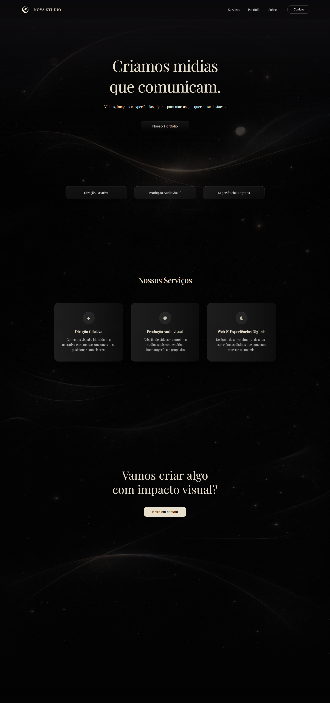
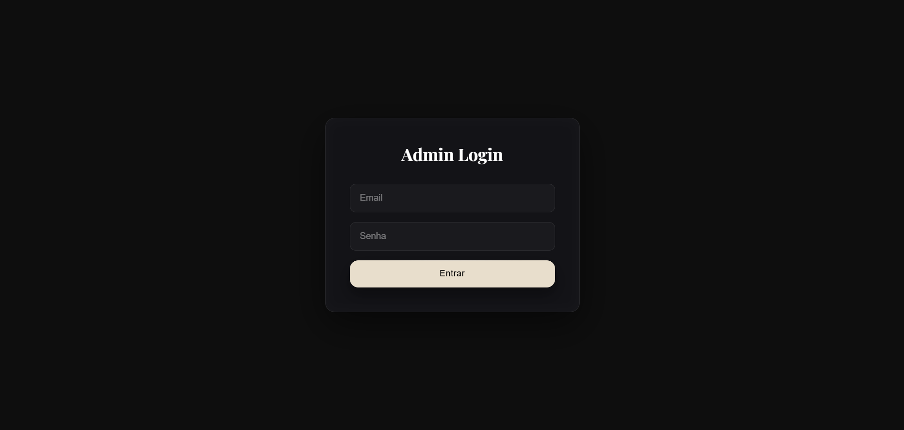
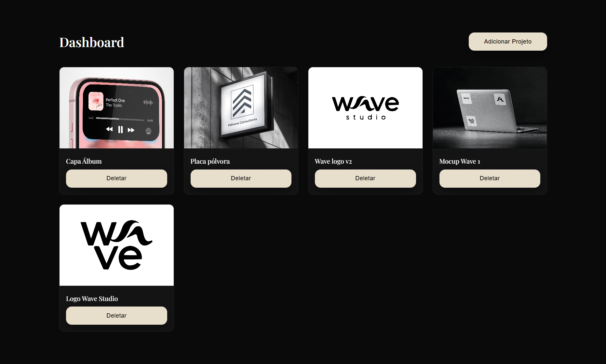

# 🚀 Portfolio Website with Admin Dashboard

Este projeto é um **portfólio web completo** desenvolvido para apresentar projetos de forma profissional e também permitir **gerenciamento de conteúdo sem necessidade de alterar código**.

O sistema possui uma **interface pública moderna** para visitantes e um **dashboard administrativo protegido por login**, onde é possível gerenciar os projetos exibidos no site.

---

# 🌐 Demonstração

🔗 **Acesse o site:**  
https://nova-six-sage.vercel.app/#/

---

# ✨ Funcionalidades

## 🏠 Landing Page
- Página inicial focada em **apresentação e atração**
- Layout moderno e minimalista
- Estrutura pensada para apresentar o desenvolvedor e seus trabalhos

## 📂 Página de Portfólio
- Listagem dinâmica de projetos
- Cada projeto contém:
  - Título
  - Descrição
  - Imagem
  - Categoria
  - Link do projeto
- Design responsivo

## 🔐 Sistema de Login
- Autenticação segura
- Acesso restrito ao painel administrativo

## 🧠 Dashboard Administrativo
Painel que permite gerenciar o conteúdo do site sem precisar alterar código.

Funções disponíveis:

- ➕ Adicionar novos projetos
- 🖼️ Upload de imagens
- ✏️ Editar projetos
- ❌ Remover projetos
- 🔄 Atualizar conteúdo do site dinamicamente

---

# 🛠 Tecnologias Utilizadas

### Frontend
- React
- Vite
- Styled Components

### Backend
- Node.js
- Express

### Banco de Dados
- MongoDB
- Mongoose

### Upload de Imagens
- Cloudinary

### Deploy
- Vercel (Front-end)
- Render(Back-end)

---

# 👨‍💻 Autor

Desenvolvido por Matheus Pólvora

💼 Portfolio em desenvolvimento
🚀 Desenvolvedor focado em experiências digitais e sistemas web

---

# 📸 Screenshots

